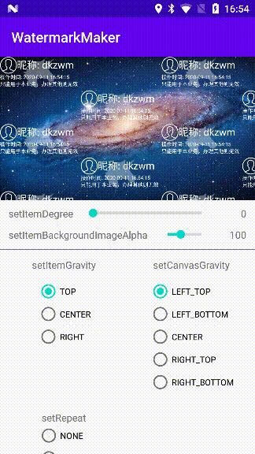

# WatermarkMaker
## [English](README_EN.md) | 中文

一款用于生成水印图的轻量级库。

## 演示程序
下载 [Demo.apk](https://raw.githubusercontent.com/dkzwm/WatermarkMaker/master/apk/demo.apk)
## 快照
</img>
## 引入
添加如下依赖到你的 build.gradle 文件:
```
dependencies {
    implementation 'me.dkzwm.graphics.wmm:core:0.0.1'
}
```
## 使用
```kotlin
    val maker = WatermarkMaker.Builder
        //创建并制定一个输出图片尺寸，实例化`ComputeSize`类代表只输出图项的图，实例化`ImageSize`类代表在图片上绘画
        .create(this, ColorSize(300, 300))
        //开始一行
        .beginRow()
        //添加一个文本标签
        .newTextMark("Test").setTextColor(mTextColor).setTextSize(
            TypedValue.applyDimension(
                TypedValue.COMPLEX_UNIT_SP,
                14F,
                resources.displayMetrics
            )
        ).setRowGravity(WatermarkMaker.RowGravity.CENTER).done()
        //添加一个图片标签
        .newImageMark(R.mipmap.ic_launcher).setScale(0.2F).setDegree(0F).done()
        //当一行中含有文本和图片标签，并且图片对齐方式为`RowGravity.BOTTOM`，那么配置当前属性为`true`后，图片底部将对齐文本基线
        .drawBaseOnBaseline(false)
        //结束当前行
        .endRow()
        //设置图项的旋转角度
        .setItemDegree(45F)
        //设置图项的内容对齐方式
        .setItemGravity(WatermarkMaker.ItemGravity.CENTER)
        //设置图项的背景图
        .setItemBackgroundImage(
            BitmapFactory.decodeResource(resources, R.mipmap.ic_launcher_round),
            100,
            45F,
            //配置为`true`代表保持图项背景图高宽比情况下铺满图项
            true
        )
        //设置画布对齐方式
        .setCanvasGravity(WatermarkMaker.CanvasGravity.LEFT_TOP)
        //设置图项的重复方式
        .setRepeat(WatermarkMaker.Repeat.REPEAT)
        .build()
    val bitmap = maker.make()
```

## License
	--------

    	Copyright (c) 2020 dkzwm

	Permission is hereby granted, free of charge, to any person obtaining a copy
	of this software and associated documentation files (the "Software"), to deal
	in the Software without restriction, including without limitation the rights
	to use, copy, modify, merge, publish, distribute, sublicense, and/or sell
	copies of the Software, and to permit persons to whom the Software is
	furnished to do so, subject to the following conditions:

	The above copyright notice and this permission notice shall be included in all
	copies or substantial portions of the Software.

	THE SOFTWARE IS PROVIDED "AS IS", WITHOUT WARRANTY OF ANY KIND, EXPRESS OR
	IMPLIED, INCLUDING BUT NOT LIMITED TO THE WARRANTIES OF MERCHANTABILITY,
	FITNESS FOR A PARTICULAR PURPOSE AND NONINFRINGEMENT. IN NO EVENT SHALL THE
	AUTHORS OR COPYRIGHT HOLDERS BE LIABLE FOR ANY CLAIM, DAMAGES OR OTHER
	LIABILITY, WHETHER IN AN ACTION OF CONTRACT, TORT OR OTHERWISE, ARISING FROM,
	OUT OF OR IN CONNECTION WITH THE SOFTWARE OR THE USE OR OTHER DEALINGS IN THE
	SOFTWARE.
